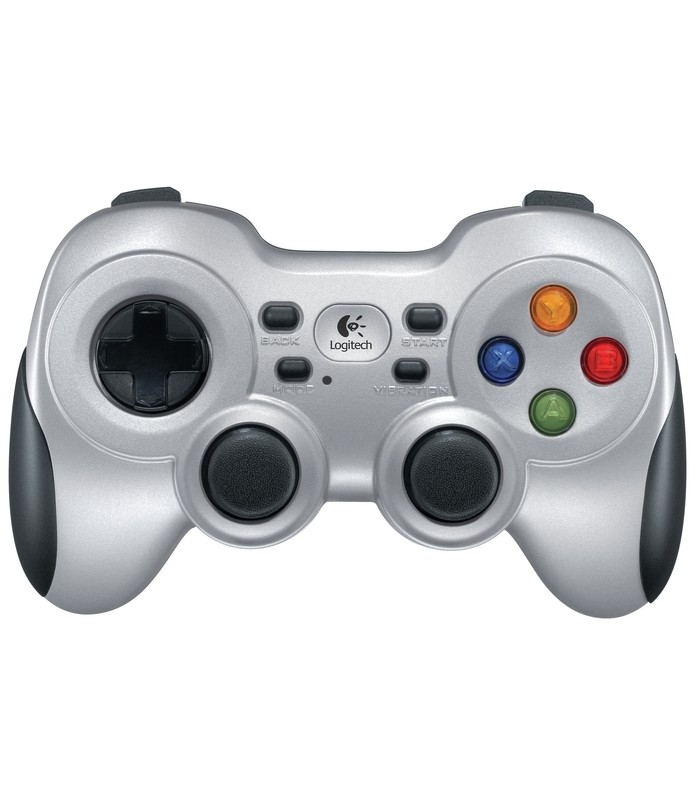

# Linux Ubuntu udev

This is a guide to setting up udev to recognize a Logitech Wireless Gamepad F710. This can be generalized to be used for devices.

## Logitech Wireless Gamepad F710
Below shows a picture of Logitech Wireless Gamepad F710.


**Step 1:**
Open a terminal and check if `99-usb-serial.rules` exist under `/etc/udev/rules.d/`
```bash
ls /etc/udev/rules.d/
```

**Step 2:**
Check for the device we are looking for

**_Method 1_**
```bash
dmseg
```

**_Method 2_**
```bash
# To know which /dev/input/XX, you should do a `ls /dev/input/`
udevadm info -a -n /dev/input/js0
```

You should look for the below attributes.  
-KERNEL
-SUBSYSTEMS
-ATTRS{idVendor}
-ATTRS{idProduct}
-ATTRS{product}

**Step 3:**
Edit `99-usb-serial.rules` and add the below line
```
# F710 logitech wireless joystick - D mode
```
KERNEL=="js*", SUBSYSTEMS=="usb", ATTRS{idVendor}=="046d", ATTRS{idProduct}=="c219", ATTRS{product}=="Logitech Cordless RumblePad 2", SYMLINK+="input/joy_wireless"
```

**Step 4:**
Finally, reboot or reload the rules
```bash
# Reload rules
sudo udevadm control --reload-rules
# Trigger rules
sudo udevadm trigger
```

**Step 5:**
Check if the rules are really updated by listing out `/dev/input/`
```bash
ll /dev/input/
```
You should see something like this
```
lrwxrwxrwx   1 root root       3 Jun  5 13:44 joy_wireless -> js0
```